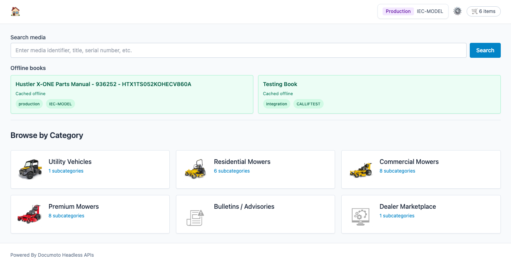
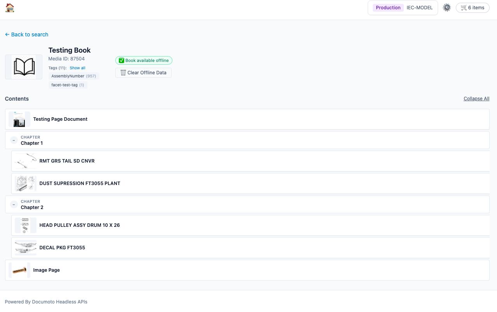
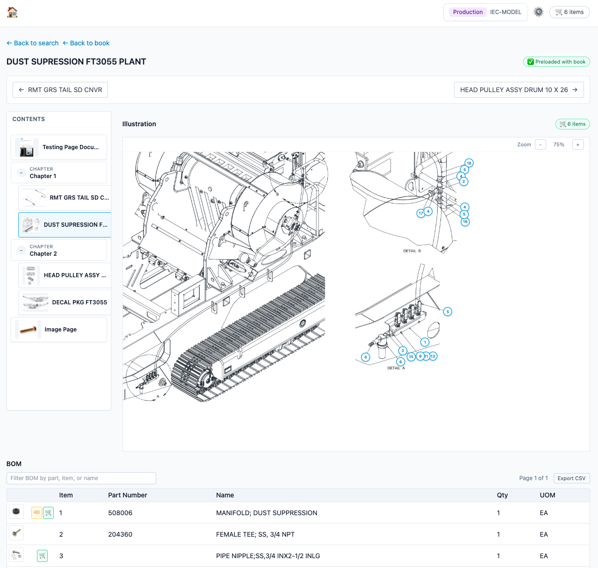

# Documoto IPC Viewer

A Vue 3 + Vite frontend for exploring **Documoto interactive parts catalogs (IPCs)**. Works in browsers, as a mobile app (iOS/Android via Capacitor), and as a desktop PWA.

**Live Demo:** Run locally or deploy the built `dist/` folder to any static hosting.

It lets you:

- **Search** for books by keyword.
- **Browse by Category** – navigate Documoto browse flows to discover books.
- Browse a book's nested **table of contents** with thumbnails.
- Open a page to view its illustration, BOM, and hotpoints (including **PDF documents**).
- Add parts from any BOM to a persistent shopping cart.
- Take an entire book **offline** and view its pages without a network.
- Track **API call counts** for transparency on Documoto API usage (toggle in Settings).

The back‑end (Node/Express) proxies the Documoto API and handles authentication.

---

## Screenshots

### Homepage
The search and browse view with category navigation and offline books list.



### Table of Contents
Nested book structure with chapters, pages, and thumbnails.



### Interactive Parts Page
Illustration with hotpoints, BOM table, and cart controls.



---

## Technology Stack

| Layer | Technology | Version |
|-------|-----------|---------|
| **Frontend Framework** | Vue 3 | ^3.5.34 |
| **Build Tool** | Vite | ^8.0.12 |
| **Router** | Vue Router | ^4.6.4 |
| **Styling** | Tailwind CSS | ^3.4.19 |
| **PDF Rendering** | PDF.js | ^4.0.379 |
| **Mobile Framework** | Capacitor | ^5.7.0 |
| **Backend** | Node.js + Express | ^4.18.2 |
| **Offline Storage** | IndexedDB + localForage | - |

---

## Prerequisites

### Required
- **Node.js** 18+ and npm
- **Git**

### For Mobile Development
- **Android:** Android Studio + Android SDK (API 33+)
- **iOS:** macOS + Xcode 14+

### For Web/Browser Testing
- Modern browser (Chrome, Safari, Firefox, Edge)
- Documoto API credentials (tenant key + API key)

---

## Project Structure

```
documoto-headless-ui/
├── frontend/                 # Vue 3 frontend application
│   ├── src/
│   │   ├── api/           # API client functions (documoto.js)
│   │   ├── components/    # Vue components (BrowseFlows, TocTree, etc.)
│   │   ├── offline/       # IndexedDB offline storage (offlineStore.js)
│   │   ├── stores/        # Pinia/Vue stores (cartStore, searchStore, tocStore)
│   │   ├── views/         # Page views (SearchView, BookView, PageView, etc.)
│   │   └── ...
│   ├── android/           # Capacitor Android project (generated)
│   ├── ios/               # Capacitor iOS project (generated)
│   └── dist/              # Production build output
│
├── server/                # Node.js Express backend
│   ├── src/index.js       # Main server file
│   └── .settings.json     # API configuration (not committed)
│
├── docs/
│   └── screenshots/       # UI screenshots for README
│
└── setup.sh               # One-command setup script
```

---

## High‑level architecture

- **Frontend:** Vue 3 with `<script setup>`, Tailwind-style utility classes, Vue Router.
- **Backend:** `server/src/index.js` (Express). Proxies Documoto endpoints such as:
  - `/library/search/v1` (media search)
  - `/library/browse-flows/v1` (category browsing)
  - `/library/media/v1/:mediaId` (media details)
  - `/library/media/v1/:mediaId/tocs` (TOC)
  - `/library/media/v1/:mediaId/tags` (media tags)
  - `/library/media/v1/:mediaId/thumbnails` (media thumbnails)
  - `/library/pages/v1/:pageId` + `/boms` + `/hotpoints` + `/page-illustrations`
  - `/library/parts/v1/:partId/thumbnails`
- **State:** Lightweight singleton stores in `src/stores/*` using `ref`/`reactive`:
  - `searchStore` – search query/results/errors.
  - `tocStore` – cached TOC by `mediaId`.
  - `cartStore` – in‑memory + `localStorage` persisted cart.
- **Offline:**
  - IndexedDB via `src/offline/offlineStore.js` for pages, illustrations, thumbnails, and cached books.
  - Minimal `service-worker.js` in `public/` for caching the app shell.
- **API Tracking:** Each view tracks Documoto API calls made. Display is controlled via Settings → "Show API call counts in UI" (hidden by default).

---

## Core flows

### 1. Searching for books

File: `src/views/SearchView.vue`

The search view is the home page (`/`). It uses `searchStore` to keep the query and results across navigation.

Behavior:

1. User types a query and presses **Enter** or clicks **Search**.
2. Frontend calls:

   ```http
   GET /api/media/search?q=<query>
   ```

3. Backend proxies to Documoto search with `type=book`:

   ```http
   GET https://integration.digabit.com/api/ext/library/search/v1?q=<query>&type=book
   ```

4. Results are normalized into an array and displayed as cards.

Clicking a card resolves an ID (`media.id || media.mediaId || media.mediaID || media.entityId`) and routes to:

```ts
{ name: 'book', params: { mediaId } }   // /media/:mediaId
```

#### Offline books list

Below the search results, a section **Offline books** shows books that have been taken offline:

```ts
import { getCachedBooks } from '../offline/offlineStore'

onMounted(async () => {
  cachedBooks.value = await getCachedBooks()
})
```

Each offline book card is clickable and opens the book view.

---

### 2. Browsing by Category (Browse Flows)

File: `src/components/BrowseFlows.vue`

The homepage also includes a **Browse by Category** section that lets users discover books through Documoto's browse flow taxonomy.

**Behavior:**

1. On mount, the component loads browse flows:

   ```http
   GET /api/browse-flows
   ```

2. Backend proxies to:

   ```http
   GET /library/browse-flows/v1
   ```

3. Renders top-level browse flow nodes as cards with thumbnails.

4. Clicking a flow with children shows its subcategories:

   ```http
   GET /api/browse-flows/:flowId
   ```

5. Clicking a leaf node (with `resultsUrl`) loads books:

   ```http
   GET /api/browse-flows/:flowId/results
   ```

**Navigation:**

- **← Back** – Returns to the previous browse level (maintains history stack).
- **← Back to categories** – At root level, returns to top-level flows.

Clicking any book result opens it in the book view.

---

### 3. Viewing a book TOC

File: `src/views/BookView.vue`

Route: `/media/:mediaId`

On mount, the book view:

1. Checks offline cache first – if the book was previously taken offline, loads TOC from cache without API calls.

2. If not cached, calls:

   ```http
   GET /api/media/:mediaId/toc
   ```

3. Backend fetches in parallel:

   - `GET /library/media/v1/:mediaId/tocs`
   - `GET /library/media/v1/:mediaId`

4. Stores `mediaInfo` and `toc` (`tableOfContents`) and caches the TOC in `tocStore` for later page navigation.

5. Also loads media tags (with pagination):

   ```http
   GET /api/media/:mediaId/tags
   ```

#### Book header

The book view displays a header with:

- **Media thumbnail** – fetched via `/api/media/:mediaId/thumbnail`
- **Title and description** – from `mediaInfo`
- **Tags** – grouped by tag name with counts, expandable to show all values
- **API call count** – transparent display of Documoto API calls made to load this view
- **Offline controls** – "Take Book Offline" and "Clear Offline Data" buttons

#### Nested TOC tree

The TOC is rendered as a **recursive tree** using `components/TocTree.vue`. The structure supports:

- Root‑level pages.
- Chapters (`type: 'chapter'`) with nested `children`.
- Arbitrarily deep nesting of chapters and pages.

`TocTree` renders:

- Chapter nodes as indented rows with a "C" badge.
- Page nodes as leaf rows with tiny illustration thumbnails and titles.

Clicking a page node calls `openPage`, which routes to:

```ts
router.push({
  name: 'page',
  params: { pageId: page.id || page.pageId },
  query: { mediaId, mediaName },
})
```

Where `mediaName` is derived from `mediaInfo` so the page view can show book context and record it in the cart.

#### API call tracking

The book view can display the count of Documoto API calls made (enable in Settings → Developer Options). When enabled, tracks:

- `GET /library/media/v1/:mediaId/tocs`
- `GET /library/media/v1/:mediaId`
- `GET /library/media/v1/:mediaId/tags` (accurately counts all paginated calls)
- `GET /library/media/v1/:mediaId/thumbnails`
- `GET /library/pages/v1/:pageId/thumbnails` (for each page in TOC)

#### Error handling

When a media item is not found (404), the view displays a user-friendly message explaining that the item may have been deleted from Documoto but still appears in search indexes temporarily.

#### Back navigation

- **← Back to search** – always routes to `{ name: 'search' }`, not browser history.

---

### 4. Viewing a page (illustration, BOM, hotpoints, PDFs)

File: `src/views/PageView.vue`

Route: `/pages/:pageId?mediaId=...&mediaName=...`

On load:

1. Try to read page details from offline cache:

   ```ts
   let data = await getPageDetails(pageId)
   ```

2. If not cached, call backend:

   ```http
   GET /api/pages/:pageId/details
   ```

   Backend fetches:

   - `GET /library/pages/v1/:pageId`
   - `GET /library/pages/v1/:pageId/boms`
   - `GET /library/pages/v1/:pageId/hotpoints`
   - Exposes illustration via `/api/pages/:pageId/illustration` (proxy for `page-illustrations`).

3. When loaded from network, page details are cached offline for future use:

   ```ts
   await savePageDetails(mediaId, pageId, data)
   ```

4. Illustration is loaded either from:

   - Offline blob URL via `getIllustrationUrl(pageId)`, or
   - Live `/api/pages/:pageId/illustration` proxy.

The view normalizes BOM and hotpoints into flat arrays and renders:

- **Left sidebar:** nested TOC for the current media (via `TocTree`), with active page highlighting.
- **Center:** illustration/PDF with zoom controls and clickable hotpoints aligned to BOM items.
- **Bottom:** BOM table with thumbnails, flags, and cart controls.

#### Multi-page type support

Pages can be one of three types:

1. **IMAGE** – Standard interactive illustration with hotpoints (default)
2. **DOCUMENT** – PDF files displayed inline using PDF.js
3. **INTERACTIVE** – Custom interactive content

For **DOCUMENT** pages:

- A PDF viewer modal opens automatically when the page loads
- PDF.js renders the document with page navigation and zoom controls
- The PDF is streamed from `/api/pages/:pageId/file`

#### BOM features

- **Thumbnails:** each BOM line with a `partId` shows a hoverable thumbnail.
- **Flags column:**
  - 🏷️ – part/page tags present.
  - 🛒 – cart/control icon; clicking toggles the part in the global cart.
- **Visibility:** `visible === false` hides the part number.
- **Filter and pagination:**
  - Search input filters BOM by part number, item, or name.
  - Only the first 25 lines of the filtered BOM are shown; simple Prev/Next controls page through results.

Example BOM interaction:

1. Filter BOM for `pump`.
2. Hover a thumbnail to inspect part imagery.
3. Click 🛒 for a line to add it to the cart.

#### Hotpoints and zoom

- Illustration is displayed with a fixed container height to avoid jumping when changing pages.
- Zoom controls adjust CSS `transform: scale(...)` while keeping coordinates aligned.
- Hotpoints are rendered as circular buttons positioned by normalized coordinates and highlight when their BOM row is selected.

#### Page offline indicator

The page header includes an indicator describing **how** the page is cached:

- ✅ **Preloaded with book** – page was cached via the **Take Book Offline** flow.
- 💾 **Cached from view** – page was visited while online and cached as a side effect.

Internally this uses `isPageCached(pageId)` and `isPagePreloaded(pageId)` from `offlineStore`.

#### Offline-aware thumbnail loading

When viewing a page from a book that is available offline:

- BOM part thumbnails are loaded from offline cache (IndexedDB) if available
- No API calls are made for thumbnails that aren't cached (blank instead)
- This prevents unnecessary API calls when the book is marked offline

#### API call tracking

The page view can display the count of Documoto API calls made (enable in Settings → Developer Options). When enabled, tracks:

- `GET /library/pages/v1/:pageId`
- `GET /library/pages/v1/:pageId/boms`
- `GET /library/pages/v1/:pageId/hotpoints`
- `GET /library/pages/v1/:pageId/page-illustrations`
- `GET /library/parts/v1/:partId/thumbnails` (for BOM items)

#### Navigation links

- **← Back to search** – goes to the search view.
- **← Back to book** – if `mediaId` is present, routes back to the book TOC.

---

## Shopping cart

Files:

- `src/stores/cartStore.js`
- `src/views/PageView.vue` (add/remove controls)
- `src/views/CartView.vue`
- `App.vue` (header cart button)

### Behavior

- Global cart state is stored in `cartStore` as `state.itemsByKey` and persisted in `localStorage` under `documoto-cart-v1`.
- Any BOM row with a `partId` gets a 🛒 icon in the **Flags** column; clicking it:
  - Adds/removes the part to/from the cart.
  - Updates the cart count in the header and near the illustration.

Each cart item includes:

- Part info: `partId`, `partNumber`, `name`, `quantity`, `unitOfMeasure`.
- Context: `pageId`, `pageName`, `mediaId`, `mediaName`.

### Cart UI

#### Header chip (App.vue)

- Shows current cart count: `🛒 3 items`.
- Clicking it routes to `/cart`.

#### PageView chip

- Above the illustration, shows a small `🛒 N items` badge when the cart is non‑empty.

#### Cart page (CartView.vue)

Route: `/cart`

Shows a table of cart items:

- **Part Number** – `partNumber || partId`.
- **Name** – item name/description.
- **Qty** – editable number input.
- **UOM** – unit of measure.
- **Page** – clickable name that routes back to that page.
- **Book** – clickable name that routes back to that book's TOC.

Examples:

- Click **Page** name → `/pages/:pageId?mediaId=...&mediaName=...`.
- Click **Book** name → `/media/:mediaId`.

Cart persists across page reloads because of `localStorage` persistence in `cartStore`.

---

## Settings

File: `src/views/SettingsView.vue`

The Settings page manages configuration profiles for accessing the Documoto API:

**Profile Configuration:**
- **Environment** – Choose between `integration` (testing) or `production`
- **Tenant Key** – Your Documoto tenant identifier
- **API Key** – Your Documoto API authentication key (stored locally)
- **Multiple Profiles** – Create and switch between different configurations

**Developer Options:**
- **Show API call counts in UI** – Toggle visibility of API usage counters on book and page views (hidden by default)

**Platform Differences:**
- **Web/Browser:** Settings are stored in `server/.settings.json` and served via the backend API
- **Mobile (iOS/Android):** Settings are stored in device `localStorage` for standalone operation

---

## Offline support

Files:

- `src/offline/offlineStore.js`
- `public/service-worker.js`
- `src/views/BookView.vue`, `src/views/PageView.vue`

### What is cached

- **Per page:**
  - Page details (`pageInfo`).
  - BOM and hotpoints.
  - Illustration image blob.

- **Per book:**
  - Metadata for the book (name, description) when `Take Book Offline` completes.
  - Table of contents (TOC).

- **Per part:**
  - BOM part thumbnails for offline viewing.

### IndexedDB schema

- `pages` store (keyPath: `pageId`):
  - `mediaId`
  - `pageId`
  - `payload` – full JSON from `/api/pages/:pageId/details`.
  - `preload` – `true` if cached via **Take Book Offline**, `false`/missing if cached from viewing.

- `illustrations` store (keyPath: `pageId`):
  - `blob` – actual image data.

- `books` store (keyPath: `mediaId`):
  - `name`, `description`, `updated` – used for the Offline books list.

- `thumbnails` store (keyPath: `partId`):
  - `blob` – part thumbnail image data for BOM items.
  - Used to display BOM thumbnails without API calls when offline.

### Take Book Offline

From `BookView.vue`, clicking **📥 Take Book Offline**:

1. Walks the TOC tree, collecting all page IDs.
2. For each page ID, if not already cached:
   - Calls `/api/pages/:pageId/details`.
   - Saves details via `savePageDetails(mediaId, pageId, data, { preload: true })`.
   - Fetches `/api/pages/:pageId/illustration` and saves the blob.
   - Fetches all BOM part thumbnails and saves them to `thumbnails` store.
3. Shows progress: `Caching pages X / Y`.
4. Displays accurate **API call count** – only counts actual API calls made (not cached pages).
5. On success:
   - Shows `Cached Y pages for offline use`.
   - Saves book metadata via `saveBookMetadata(mediaId, mediaInfo)`.
   - Sets the **Book available offline** badge.

### Clear Offline Data

Also in `BookView.vue`, **🗑 Clear Offline Data**:

1. Calls `clearBookForMedia(mediaId)`.
2. Deletes all `pages` and `illustrations` entries for that `mediaId`.
3. Deletes the corresponding `books` entry.
4. Clears the book‑level offline badge.

### Service worker

`public/service-worker.js` provides a minimal PWA shell cache:

- Caches `/` on install.
- On fetch:
  - **API calls** (`/api/...`) and other origins – go to network.
  - **`/`** – cache‑first, fall back to network.
  - Other same‑origin paths – network‑first, fall back to cache.

After first load, you can reload `/` while offline and the app shell will still start; from there, offline‑cached books/pages will render from IndexedDB.

---

## Configuration

### Web/Browser Mode (`server/.settings.json`)

Create this file in the `server/` directory:

```json
{
  "profiles": [
    {
      "id": "default",
      "name": "Integration",
      "environment": "integration",
      "tenantKey": "your-tenant-key",
      "apiKey": "your-api-key"
    }
  ],
  "activeProfileId": "default"
}
```

**Note:** This file is gitignored to protect your credentials.

### Mobile Mode (Settings Page)

1. Open the app on your device
2. Navigate to **Settings** (`/settings`)
3. Create a profile with your Documoto credentials
4. The credentials are stored securely in device `localStorage`

---

## Running the app

### Quick setup

To install all dependencies at once, run the setup script from the project root:

```bash
./setup.sh
```

This script will:
- Check for Node.js installation
- Install server dependencies
- Install frontend dependencies
- Check for mobile development tools (Android SDK, Xcode)

### Testing on a computer (web browser)

For web development and testing in a browser:

```bash
cd server
npm install
npm run dev   # Backend proxy server on http://localhost:3001

cd ../frontend
npm install
npm run dev   # Vite dev server on http://localhost:5173
```

The browser version uses a backend proxy to handle CORS and authentication. Make sure your profiles are configured in `server/.settings.json`.

### Testing on a mobile device (Android/iOS)

For mobile testing, the app uses Capacitor to wrap the web app as a native application. The mobile app makes direct API calls to Documoto (no backend proxy).

**Build and sync for Android:**

```bash
cd frontend
npm run build              # Build the web app
npm run android:sync       # Sync web assets to Android project
npm run android:open       # Open Android Studio
```

Then in Android Studio:
1. Wait for Gradle sync to complete
2. Select your device/emulator from the device dropdown
3. Click the Run button (green triangle) or press `Shift + F10`

**Build APK directly from command line:**

```bash
cd frontend/android
./gradlew assembleDebug
```

The APK will be at `android/app/build/outputs/apk/debug/app-debug.apk`

**Build and sync for iOS:**

```bash
cd frontend
npm run build              # Build the web app
npm run ios:sync          # Sync web assets to iOS project
npm run ios:open          # Open Xcode
```

Then in Xcode:
1. Select your target device or simulator
2. Click the Run button

**Key differences between web and mobile:**

| Feature | Web/Browser | Mobile (iOS/Android) |
|---------|-------------|---------------------|
| **API Calls** | Via backend proxy (CORS handled) | Direct via Capacitor HTTP |
| **Configuration** | `server/.settings.json` | Settings page → `localStorage` |
| **Storage** | browser cache | IndexedDB + Filesystem plugin |
| **PDF Viewer** | PDF.js in iframe | PDF.js with local worker |
| **Offline** | Service worker + IndexedDB | IndexedDB + native filesystem |

---

## Troubleshooting

### Common Issues

**401 Unauthorized on iOS**
- Ensure your profile has valid API credentials in Settings
- Check that `activeProfileId` matches your profile ID
- Verify API key hasn't expired

**Thumbnails not loading on mobile**
- This is expected behavior when offline - thumbnails load from cache only
- When online, thumbnails fetch via authenticated API calls
- Browse flow results and BOM thumbnails now use blob URLs for mobile compatibility

**PDF won't load / version mismatch error**
- The PDF.js worker is now bundled locally (not from CDN)
- If issues persist: `npm ci` to reinstall exact versions

**Android build fails**
- Ensure Android SDK is installed (API 33+)
- Check `JAVA_HOME` environment variable
- Run `./gradlew clean` before rebuilding

**iOS build fails in Xcode**
- Ensure Capacitor sync completed: `npm run ios:sync`
- Check that `NSAppTransportSecurity` allows arbitrary loads (for development)
- Clean build folder: Product → Clean Build Folder

**Settings not saving on mobile**
- Check browser console for `localStorage` errors
- Ensure device has storage permissions
- Try clearing app data and reconfiguring

---

## API Endpoints

The app interacts with these Documoto API endpoints:

### Browse & Search
- `GET /library/browse-flows/v1` - List browse categories
- `GET /library/browse-flows/v1/:flowId` - Browse flow details
- `GET /library/search/v1?q=&type=book` - Search media

### Books (Media)
- `GET /library/media/v1/:mediaId` - Media details
- `GET /library/media/v1/:mediaId/tocs` - Table of contents
- `GET /library/media/v1/:mediaId/tags` - Media tags (paginated)
- `GET /library/media/v1/:mediaId/thumbnails` - Media thumbnail

### Pages
- `GET /library/pages/v1/:pageId` - Page details
- `GET /library/pages/v1/:pageId/boms` - Bill of materials
- `GET /library/pages/v1/:pageId/hotpoints` - Interactive hotpoints
- `GET /library/pages/v1/:pageId/page-illustrations` - Page illustration image
- `GET /library/pages/v1/:pageId/thumbnails` - Page thumbnail
- `GET /library/pages/v1/:pageId/page-file` - PDF file for documents

### Parts
- `GET /library/parts/v1/:partId/thumbnails` - Part thumbnail for BOM

---

## Security Notes

- **API Keys:** Never commit `server/.settings.json` or mobile credentials to git
- **iOS ATS:** Configured to allow arbitrary loads for development (see `Info.plist`)
- **CORS:** Backend proxy handles CORS for web; Capacitor HTTP bypasses CORS on mobile
- **Offline Data:** Cached data is stored unencrypted in IndexedDB/device storage

---

## Development Tips

### Hot Reload
- **Web:** Vite dev server provides instant HMR at `http://localhost:5173`
- **Mobile:** Use Capacitor Live Reload (configure in `capacitor.config.json`)

### Debugging
- **Web:** Browser DevTools → Console/Network/Application (IndexedDB)
- **iOS:** Safari → Develop → [Device] → Web Inspector
- **Android:** Chrome → chrome://inspect → Remote devices

### Testing Offline
1. Open DevTools → Network → Check "Offline"
2. Or disable WiFi on device
3. Navigate to a previously cached book

---

## License

MIT - See LICENSE file (if included) or contact the author.

---

## Contributing

This is a reference implementation. Feel free to fork and modify for your use case. Key extension points:

- **Custom styling:** Modify Tailwind classes in components
- **Additional API endpoints:** Add functions to `src/api/documoto.js`
- **Offline sync strategies:** Extend `src/offline/offlineStore.js`
- **Authentication:** Implement OAuth flow in server proxy

---

### Desktop App (PWA on macOS)

You can install the web app as a desktop application using your browser's PWA capabilities:

**Safari (macOS):**
1. Open the app URL in Safari (e.g., `http://localhost:5173` or your deployed URL)
2. **File** → **Add to Dock**
3. The app appears in Dock and Launchpad with its own window (no browser chrome)

**Chrome:**
1. Open the app URL
2. Click the **📥 Install** icon in the address bar
3. Check "Open as window" → Click **Install**
4. App appears in Launchpad and Chrome Apps folder

**Edge:**
1. Open the app URL
2. Click **•••** menu → **Apps** → **Install this site as an app**
3. App appears in Applications folder and Launchpad

**Once installed:**
- App opens in its own window (no browser address bar/tabs)
- Works offline with cached data
- Launches from Dock/Launchpad like a native app
- Use **Cmd+Space** to search for "Documoto" to launch quickly

---

## Example end‑to‑end usage

1. **Browse by category**
   - Go to `/`.
   - See **Browse by Category** section with Documoto browse flows.
   - Click through categories to discover books.
   - Click a book to open `/media/:mediaId`.

2. **Search for a book**
   - Enter `SimpleBook` in the search field and click **Search**.
   - Click a result to open `/media/:mediaId`.

3. **Explore the TOC**
   - See book header with thumbnail, tags, and API call count.
   - Browse nested chapters and pages with thumbnails.
   - Notice the **93 API Calls** badge showing Documoto API usage.
   - Click a deep nested page (e.g., under `Chapter 2.2.2...`).

4. **Work with a page**
   - Inspect the illustration and BOM.
   - See API call count for this page load.
   - Click hotpoints to highlight BOM rows.
   - Filter BOM for `filter text`.
   - Add a few parts to cart via 🛒.
   - For PDF documents, view inline with PDF.js viewer.

5. **Configure settings**
   - Go to `/settings`.
   - Enter your Documoto **Tenant Key** and **API Key**.
   - Optionally enable **Show API call counts in UI** (Developer Options) to see API usage.
   - Click **Save Settings**.

6. **Take book offline**
   - Back in the book view, click **📥 Take Book Offline**.
   - Watch progress: `Caching pages X / Y`.
   - If API tracking is enabled, see accurate **API call count** for the preload process.
   - On completion, see **Book available offline** badge.

7. **Go offline and reload**
   - Disconnect network.
   - Reload `/` – app still loads via service worker.
   - In **Offline books**, click your cached book.
   - Navigate to pages; they load from offline cache.
   - Notice no API calls are made for thumbnails when viewing cached pages.

8. **Review cart**
   - Click the cart chip in the header.
   - See all selected parts, adjust quantities, and click page/book names to jump back to context.

9. **Install as desktop app (optional)**
   - In Safari: **File** → **Add to Dock**
   - Or in Chrome/Edge: Use the browser's install option
   - Launch the app from Dock/Launchpad like a native application

This README is a living document; update it as you add new flows or API integrations.
